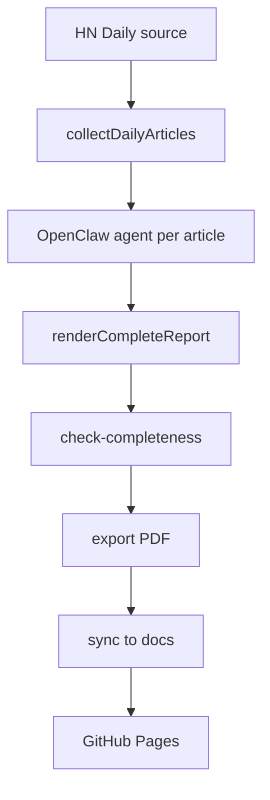

# HN Daily Skill

[](https://levix.github.io/hn-daily-skill/)
[](https://github.com/Levix/hn-daily-skill/actions/workflows/pages-refresh.yml)

一个将 [Hacker News Daily](https://www.daemonology.net/hn-daily/) 热门文章自动生成中文完整总结、导出 PDF，并发布到 GitHub Pages 的自动化流水线。

在线阅读地址：<https://levix.github.io/hn-daily-skill/>
源码仓库：<https://github.com/Levix/hn-daily-skill>

## Overview

这个仓库面向“每天产出一份可发布的 HN 中文日报”场景，当前主流程包括：

1. 抓取指定日期的 HN Daily 页面与原文内容
2. 逐篇调用 OpenClaw agent 生成结构化中文总结
3. 拼装为完整 Markdown 报告并做完整性校验
4. 导出 PDF、生成运行记录，并同步到 GitHub Pages

仓库同时保留了一条草稿链路，但对外发布和 Pages 展示只认 complete 产物。

## Features

- 自动抓取指定日期的 HN Daily 热门文章
- 逐篇生成中文标题、摘要、关键要点和技术洞察
- 输出发布级 Markdown、PDF 和运行记录
- 支持单日补跑与定时任务驱动
- 自动构建 `docs/` 静态站点并发布到 GitHub Pages
- 对生成结果执行完整性门禁，避免半成品发布

## How It Works

完整流水线如下：



```text
HN Daily source
  -> collectDailyArticles
  -> OpenClaw agent (per article)
  -> render complete report
  -> check-completeness
  -> export PDF
  -> sync to docs/
  -> GitHub Pages
```

当前仓库有两条产物链路：

- 草稿链路：`scripts/auto-digest.mjs`
  负责抓取数据并生成草稿 Markdown，不参与正式发布。
- complete 链路：`scripts/generate-complete.mjs`
  负责生成正式中文成稿，是发布链路的权威入口。

## Repository Layout

```text
scripts/     CLI scripts and pipeline entrypoints
output/      Generated draft / complete reports / run manifests
scripts/lib/ OpenClaw provider, parser, prompt and renderer modules
docs/        GitHub Pages site and published daily reports
.github/     GitHub Actions workflows
```

## Prerequisites

运行完整发布链路前，需要具备以下环境：

- Node.js 20+
- 可用的 `openclaw` CLI
- 可访问的 OpenClaw agent 运行环境
- 对目标仓库 `main` 分支的推送权限
- 已启用 GitHub Pages，并配置为从 `main:/docs` 发布

如果在 OpenClaw 环境中运行，建议显式设置 agent 路由，例如：

```bash
export OPENCLAW_AGENT=product
```

Provider 也支持这些环境变量：

- `OPENCLAW_AGENT_ID`
- `OPENCLAW_SESSION_ID`
- `OPENCLAW_TO`
- `OPENCLAW_CHANNEL`

## Quick Start

最短路径是直接运行完整流水线：

```bash
npm install
OPENCLAW_AGENT=product npm run daily:pipeline -- --date 2026-03-28
```

执行成功后会生成：

- `output/hn-daily-2026-03-28-complete.md`
- `output/hn-daily-2026-03-28-complete.pdf`
- `output/hn-daily-2026-03-28-run.json`
- `docs/data/2026-03-28.md`
- `docs/data/2026-03-28.pdf`

## Common Commands

### Generate a draft

```bash
node scripts/auto-digest.mjs --date 2026-03-28
```

### Generate a complete report

```bash
OPENCLAW_AGENT=product node scripts/generate-complete.mjs --date 2026-03-28
```

### Run the full pipeline

```bash
OPENCLAW_AGENT=product npm run daily:pipeline -- --date 2026-03-28
```

### Validate a generated Markdown report

```bash
node scripts/check-completeness.mjs output/hn-daily-2026-03-28-complete.md
```

### Rebuild GitHub Pages data

```bash
npm run build:pages
```

### Sync published artifacts to `docs/`

```bash
node scripts/sync-pages-and-push.mjs --date 2026-03-28
```

## Artifact Contract

正式发布只认 complete 产物。

- 草稿 Markdown：`output/hn-daily-YYYY-MM-DD.md`
- 发布 Markdown：`output/hn-daily-YYYY-MM-DD-complete.md`
- 发布 PDF：`output/hn-daily-YYYY-MM-DD-complete.pdf`
- 运行记录：`output/hn-daily-YYYY-MM-DD-run.json`

其中：

- `*-complete.md` 是 GitHub Pages 和同步脚本的主输入
- `*-complete.pdf` 是对外分发的导出文件
- `*-run.json` 记录当次生成是否完成，以及各篇文章的处理结果

## Automation

### OpenClaw cron

仓库可通过 OpenClaw cron 定时执行完整流水线。当前推荐调度方式是：

- 每天早上 `08:30` 启动
- 处理前一天的 HN Daily 数据
- 执行命令：`OPENCLAW_AGENT=product npm run daily:pipeline -- --date <YYYY-MM-DD>`

### GitHub Actions

仓库包含 `Refresh Pages Data` workflow，用于：

- 定时刷新 Pages 数据
- 手动触发 Pages 刷新
- 在 `docs/**`、`output/*-complete.md`、`scripts/build-pages.mjs` 等相关内容变更时自动刷新

## GitHub Pages

`docs/` 是静态站点目录，包含：

- `docs/index.html`：站点入口
- `docs/app.js`：前端加载逻辑
- `docs/data/index.json`：日报索引
- `docs/data/*.md`：已发布的 Markdown 报告
- `docs/data/*.pdf`：已发布的 PDF 报告

GitHub Pages 推荐配置：

1. 打开仓库 `Settings -> Pages`
2. `Source` 选择 `Deploy from a branch`
3. Branch 选择 `main`
4. Folder 选择 `/docs`

如果需要为 README、发布说明或排障记录生成页面可视化素材，可以使用 `agent-browser` 访问
<https://levix.github.io/hn-daily-skill/>，获取：

- 首页截图
- 示例页面预览
- 发布后页面是否已更新的可视化确认

## Troubleshooting

### Page content is not updated

先检查这三层：

1. `main` 分支是否已经包含目标日期的 `docs/data/*.md` 和 `docs/data/index.json`
2. `Refresh Pages Data` 或 `github-pages` 部署是否成功
3. 线上 `https://levix.github.io/hn-daily-skill/data/index.json` 是否已反映最新日期

如果仓库内容是新的、站点内容仍是旧的，问题通常在 GitHub Pages 部署队列或 workflow 触发层。

### `generate-complete.mjs` fails

重点检查：

- `openclaw agent --json` 在当前环境是否可用
- 是否设置了正确的 agent 路由，例如 `OPENCLAW_AGENT=product`
- OpenClaw 返回内容是否能解析为结构化摘要

### `check-completeness.mjs` fails

这个检查器只支持 Markdown，不支持直接校验 PDF。应改为检查对应的 `*-complete.md`。

### `sync-pages-and-push.mjs` fails

通常是以下前置条件不满足：

- 缺少 `*-complete.md`
- 缺少 `*-complete.pdf`
- 缺少 `*-run.json`
- `run.json.status !== "completed"`
- Markdown 完整性检查未通过

## Limitations

- complete 链路依赖 OpenClaw agent，可用性受运行环境影响
- `check-completeness.mjs` 目前只校验 Markdown
- 草稿链路仍然存在，但不属于正式发布物
- 站点刷新最终仍依赖 GitHub Pages 的部署状态

## License

This project is licensed under the MIT License. See [LICENSE](LICENSE).
